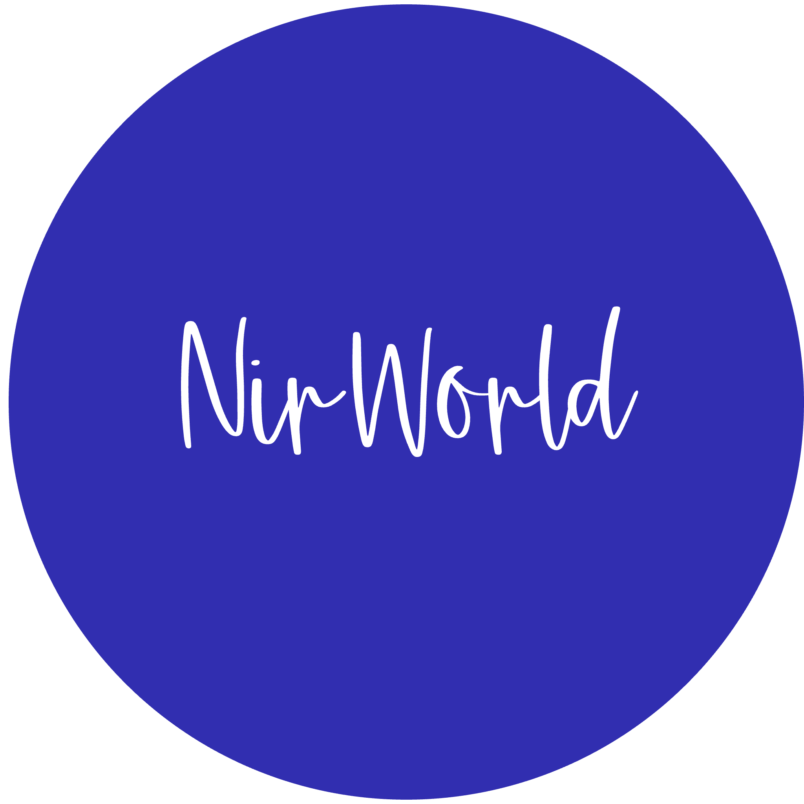

# NirWorld — Professional Portfolio

  
  
  # Niraj Kumar
  ### **Principal Mobile Architect & AI Solutions Leader**
  
  
  
  
  

---

## 👨‍💻 Profile Preview

I am a **PMP® certified Managing Consultant** and **Principal Mobile Architect** with **14+ years** of hands-on experience designing, architecting, and shipping high-performance applications across iOS, Android, and cross-platform stacks. 

I specialize in leading high-impact engineering programs, bridging the gap between complex business requirements and robust, scalable technical implementations. Currently, I am pioneering the next generation of spatial computing and **AI-enabled mobile experiences** (integrating LLMs, RAG architectures, Autonomous Agents, and on-device ML).

  <table style="border: none; border-collapse: collapse;">
    <tr>
      <td align="center" style="padding: 20px; border: 1px solid #e1e4e8; border-radius: 8px;">
        <h3 style="margin: 0; color: #00c8ff;">14+</h3>
        
Years Experience

      </td>
      <td align="center" style="padding: 20px; border: 1px solid #e1e4e8; border-radius: 8px;">
        <h3 style="margin: 0; color: #7c5cfc;">10+</h3>
        
Apps Shipped

      </td>
      <td align="center" style="padding: 20px; border: 1px solid #e1e4e8; border-radius: 8px;">
        <h3 style="margin: 0; color: #00e5a0;">8+</h3>
        
Gov & Enterprise Clients

      </td>
      <td align="center" style="padding: 20px; border: 1px solid #e1e4e8; border-radius: 8px;">
        <h3 style="margin: 0; color: #ffa94d;">10</h3>
        
Professional Certifications

      </td>
    </tr>
  </table>

---

## 🛠️ Core Technology Stack

- **AI & Intelligent Systems:** Large Language Models (LLMs), Autonomous AI Agents, RAG Pipelines, Model Context Protocol (MCP), Google Vertex AI, On-Device Machine Learning (Google ML Kit), Computer Vision.
- **Mobile Engineering:** Native iOS (Swift, SwiftUI), Spatial Computing (ARKit, RealityKit), Native Android (Java, SDK), React Native, Ionic Framework, Clean Architecture & MVVM.
- **Cloud & DevOps:** RESTful API Design, Firebase, WebSockets (Socket.io, XMPP), CI/CD (Jenkins, Fastlane), Python Scripting.
- **Management & Delivery:** PMP® Certified Project Management, Agile & Scrum Methodologies, System Architecture Reviews, Executive Stakeholder Engagement, Cross-Functional Team Leadership.

---

## 📜 Key Certifications

- **Project Management Professional (PMP®)** — *Project Management Institute*
- **AI Systems Design: RAG Pipelines and LLM Architecture** — *Board Infinity*
- **Architect AI Systems: From Concept to Code** — *Coursera*
- **AI Tools Workshop** — *Be10x*
- **AI Agents Fundamentals** — *Hugging Face*
- **Generative AI Overview for Project Managers** — *Project Management Institute*
- **AR and the Web** — *Curtin University / edX*

---

## 🚀 Featured Project: Conja
An advanced **AI & AR Spatial Learning Platform** designed and engineered for iOS. Conja leverages Apple **ARKit & RealityKit** for 3D environments, **Google ML Kit** for pose/face/object tracking, and **Vertex AI** for context-rich intelligent responses, powered by a real-time Firestore database.

---

## 🌐 Visit the Site

Explore my full portfolio, professional timeline, awards, and complete details at:
👉 **[https://nirworld.co.in](https://nirworld.co.in/)**

---

  Patna, Bihar, India • <a href="mailto:kamal.nirajb@gmail.com">kamal.nirajb@gmail.com</a> • +91 70042 82937

